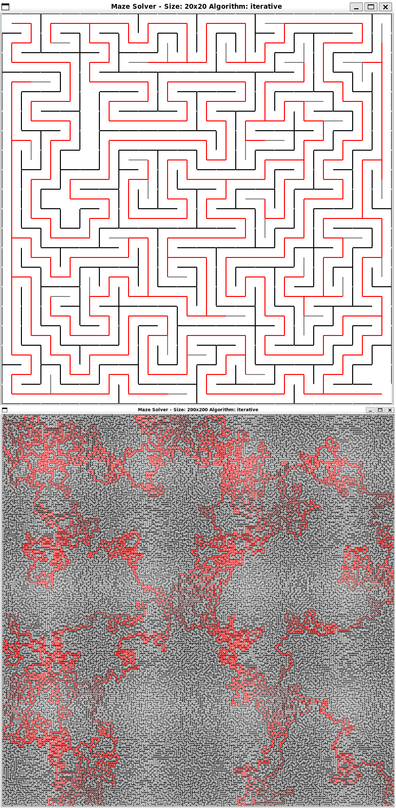

Simple maze solver implemented in Python. Created as part of speedrunning a one free month on boot.dev.

Both a recursive and a iterative approach is implemented.
For large mazes the recursion depth can grow very high.
The program will try to raise the recursion limit to be able to recurse the entire maze using

```sys.setrecursionlimit()```

But do note that this can result in a stack overflow and crash the program.
The iterative algorithm that circumvents this is the default.

### Usage
```
usage: main.py [-h] [--columns COLUMNS] [--rows ROWS] [--algorithm ALGORITHM] [--width WIDTH] [--height HEIGHT] [--slow]

Maze Solver

options:
  -h, --help            show this help message and exit
  --columns COLUMNS     Number of columns in the maze
  --rows ROWS           Number of rows in the maze
  --algorithm ALGORITHM
                        Choose if the generation and solving should be performed recursively or iteratively: recursive, iterative
  --width WIDTH         Window width in pixels
  --height HEIGHT       Window height in pixels
  --slow                Run the program in slow mode so the programs work is easier to follow. For large mazes it can get a bit slow anyway :)
  ```

### Example run


